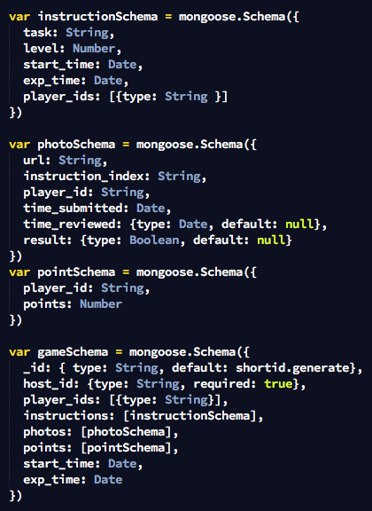
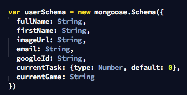

#Snap This
**A multiplayer photo scavenger hunt game**

This is our 3rd project for General Assembly's [Web Development Immersive](https://generalassemb.ly/education/web-development-immersive) class. This app was created using the MEN Stack (Mongodb, Express, Node) and Websockets (for real time, multiplayer updates).

This game was created with the intention to make organizing scavenger hunts easier. Create a scavenger hunt by adding a series of clues to your game, then invite your friends by sharing a unique code to join. To play, all other players will have to submit photos one at a time for each clue on the list in the order they appear. But before they move on to the next clue, you--as the host--have to accept or reject the photo. At the end of the game, everyone will see all the photos that were taken throughout the game.

This app is currently deployed to Heroku at: [https://snap-this.herokuapp.com/](https://snap-this.herokuapp.com/)

##About us
This project was created by:

- AJ Almaguer - [https://github.com/ajalmaguer](https://github.com/ajalmaguer)
- Brigette Morado - [https://github.com/bmorando](https://github.com/bmorando)
- Marcos Felix - [https://github.com/Marcos27](https://github.com/Marcos27)
- Victor Tran - [https://github.com/murtato](https://github.com/murtato)

##Technologies Used
This project was created using Node, Express, and MongoDB.

The game itself is essentially a single-page app. The serve sends the appropriate page to the user and the user then makes api calls via AJAX to update the DOM as the game is being played.


###The following node packages were installed:

| Package                 | Purpose                                  |
| ----------------------- | ---------------------------------------- |
| ejs                     | Server-side templating. We use this instead of Jade |
| mongoose                | Interfaces with MongoDB, creates models and model schemas. |
| passport                | Handles authentication                   |
| passport-google-oauth20 | Handles Google oauth                     |
| shortid                 | Creates short Mongo document id's, which are used to allow players to easily connect to a game. |
| socket.io               | Implements websockets so that the game is in real-time. |


###The following css/javascript libraries were also used:
| Library                                  | Purpose                                  |
| ---------------------------------------- | ---------------------------------------- |
| jQuery                                   | DOM manipulation, required for Materialize plugin (see bleow) |
| [Materialize CSS and JS](http://materializecss.com/) | Used to create all the user interface components of the site. |
| [Lodash](https://lodash.com/)            | Used for client-side templating.         |


Models
-----------------------------

**Game**

Every game you play creates a new game model, which keeps track of most of the game using embedded documents. 



**User**

The user model keeps track of a user's current game and current task. This was done to ensure that a user can only join one game at a time.




Pivotal Tracker
------------------------------

The project's user stories are documented and managed on pivotal tracker. See the project here: [https://www.pivotaltracker.com/n/projects/1581705](https://www.pivotaltracker.com/n/projects/1581705)


Installation Instructions
==========================
1. Clone the repo from your terminal `git clone https://github.com/ajalmaguer/student-portal.git`
2. Go into the directory and perform the following:
   a. Install the npm packages `npm install`
   b. Create .env file in the directory and create the following variables (p.s. you need mongo installed on your computer):
   ```shell
   DATABASE_URL=<your m-lab database url>
   GOOGLE_CLIENT_ID=<your google client id>
   GOOGLE_SECRET=<your google secret>
   GOOGLE_CALLBACK=<your google callback>
   SECRET_KEY_BASE=<your secret key base>

   ```
   c. Run nodemon: `nodemon`
   d. Connect to server from the browser. I.e. go to `localhost:3000`


Next Steps
=================
The next steps we'd like to take for this project are as follows:
1. **File Upload:** Right now, we can only submit photo urls. The next step is to allow users to directly upload their photos to the site.
2. **Re-write the entire game with websockets only.** We initially wrote the game using AJAX and then added websockets at the very end, but we realized that we could have just used websockets at the very end of the project.
